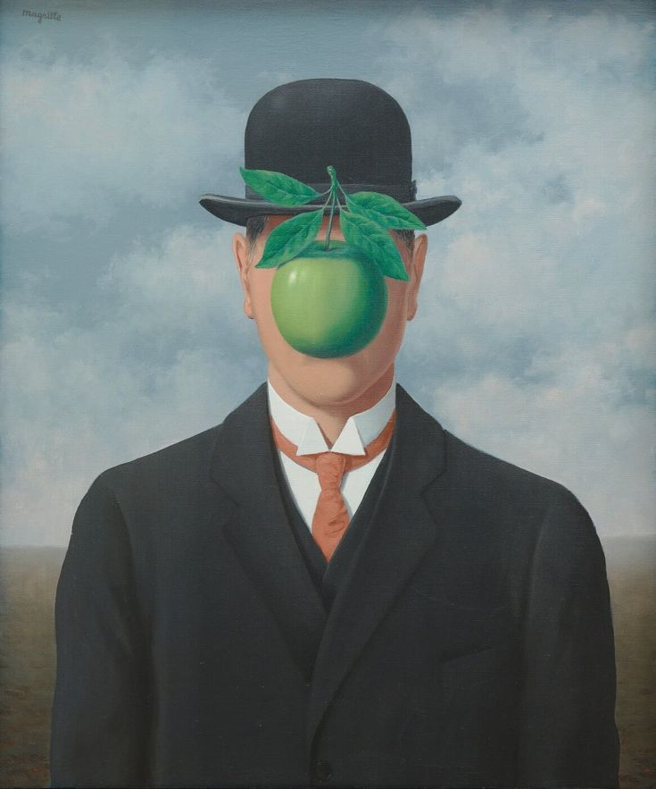

# Aleksandr Seryapin 

**Date:** of birth: 20.12.1886  
**Addres:** Saint-Petersburg  
**Family Status:** married    
**Email:** *al_seryapin@mail.ru*  

## PERSONAL PROFILE:
I am Electronics Engineer with experience of programming microcontrollers and supporting sales web sites. And I want to be real Frontend Engineer. I am work as Frontend Engineer in big company but I want to update my skills.

## EDUCATION:  
1963-2009 **Ryazan State Radio Engineering University, Ryazan, Russia**  
**Specialization:**  Design electrical equipment and power supply system of electrical equipment.  

12.2020 - 06.2021	Course **“Interface development: layout and JavaScript”** run by Moscow Institute of Physics and Technology      
07.2021 - present	Course **“JavaScript Front-end”** run by Rolling Scopes School

## KNOLEDGE
* JavaScript, Node.js, C
* Visual Studio Code, Version control Git
* HTML5, CSS3,
* Responsive design, browsing developer tools

## ENGLISH SKILLS
Upper-Intermediate (B2) level  of English.    
Experience of conducting technical and commercial negotiations, provide presentations, oral translation for customers during tripartite meeting. 

## WORK EXPERIENCE:  
02.2022 - present **["The Biggest Russia IT Company"]**  
**Position:** Frontend Developer.  

08.2017 – 02.2022  **["EFO" LLC"](http://efo.ru/)**  
**Position:** Head of Power Management Unit.  
**Main responsibilities:** Promotion of power supplies units for Russian market; website support: filling with content and creating landing pages; negotiations with foreign manufactures; technical support of customers and integration troubleshooting; 

06.2015 – 08.2017  **["PeterburgElectronComplekt" LLC](http://pec.ru)**  
**Position:** Brand Manager.  
**Main responsibilities:** Promotion of electronic components for demanding applications; website support: filling with content; technical support of customers and integration troubleshooting; organizing and translating technical seminars with foreign manufactures; communication with region sales managers of foreign manufacturers; preparation of marketing plans.

01.2015 – 06.2015  **[TET ESTEL, Tallinn](http://www.tet-estel.com/)**   
**Position:** Project engineer of avionic ground power supply unit.  
**Main responsibilities:** Making requirements specifications for new equipment; managing design team (designers, engineers, programmers); making gesign plans; choosing key electronics components; project control.

08.2011 – 01.2015  **[NIPK “Electron”, Co., Saint-Petersburg, Russia](http://electronxray.com/)**  
**Position:** Electrical engineer, high voltage power supply group  
**Main responsibilities:** Designing of medical X-ray equipment; preparation of technical documentation; writing of technical documentation. requirements specifications for mechanical design engineer and programming engineer.

06.2008 – 07.2011	**[“NPP FEB”, Ltd.](http://www.feb.spb.ru/)**      
**Position:** Electrical engineer, research and development unit.   
**Main responsibilities:**Programming microcontrollers by “C”; designing of welding equipment including MIG/MAG, TIG, MMA and wire feed; managing engineers; preparation of technical documentation.

## ADDITIONAL INFORMATION:
Experienced in managing people.   
Driving license, category B.
